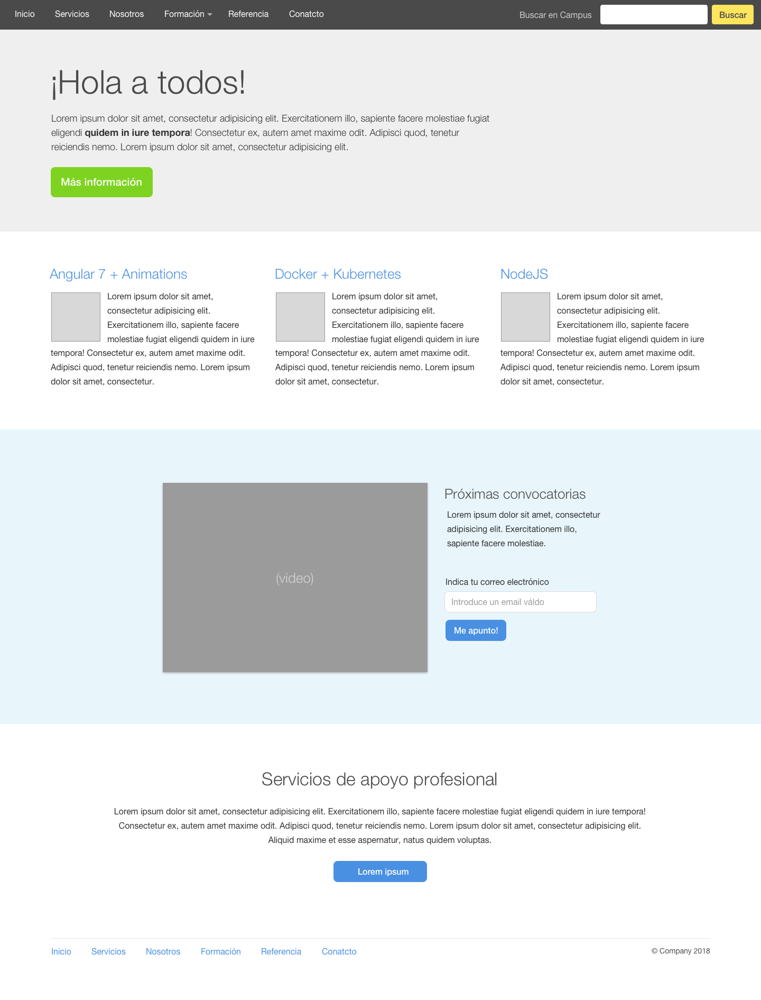

# Estructurar una Home page

Nuestro primer ejercicio será el de estructurar una Home page acorde al diseño `home.sketch` disponible en este repositorio y a la vez en [Zeplin](https://app.zeplin.io/projects).

Por el momento solo se requiere estructurar la página `Día 1 - Home - Desktop` (imagen a continuación) prestando atención a la semántica del contenido. En los próximos días aplicaremos los estilos, las interacciones y la parte responsive.

¡Buen trabajo!

